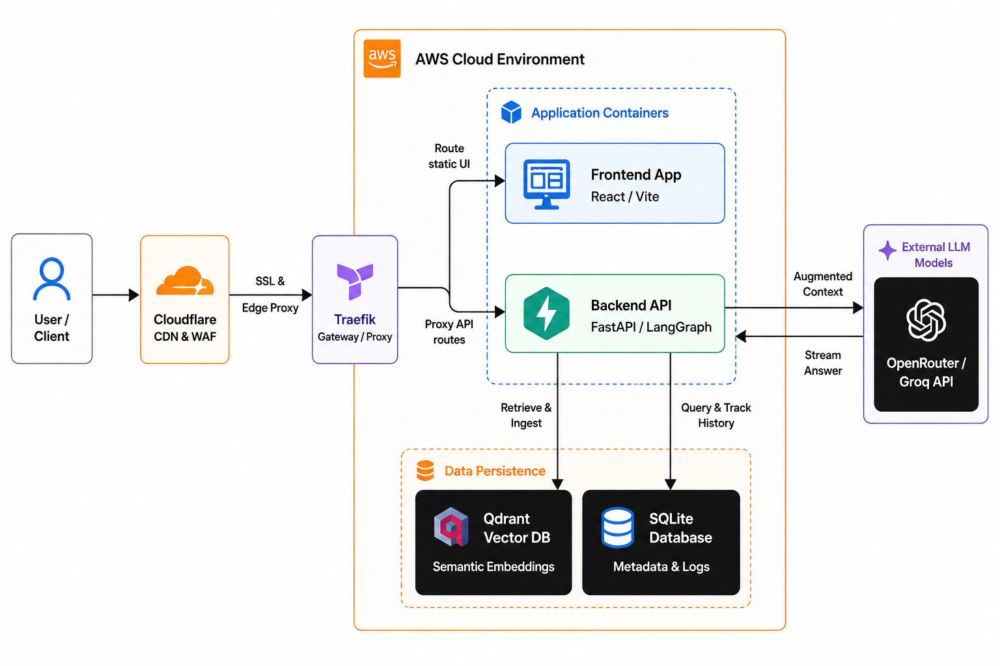
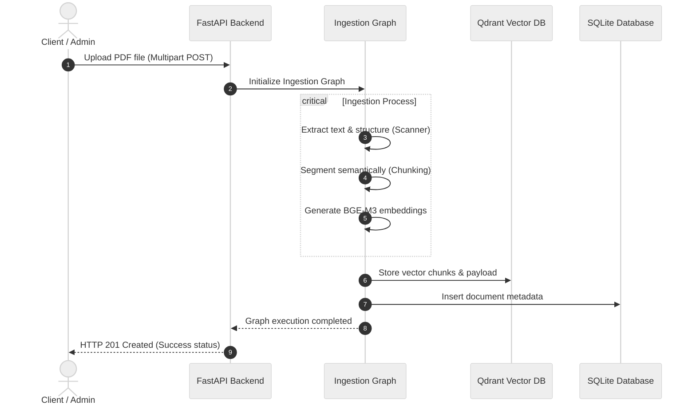
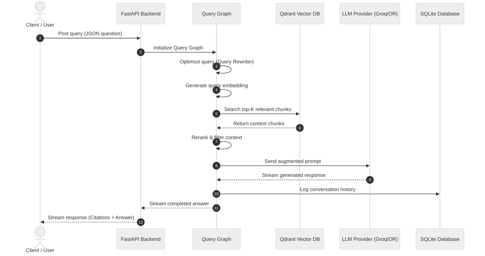
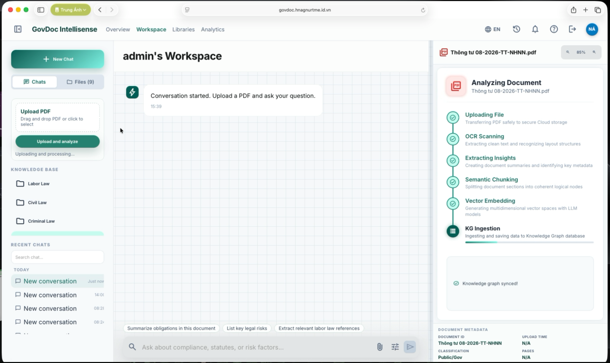
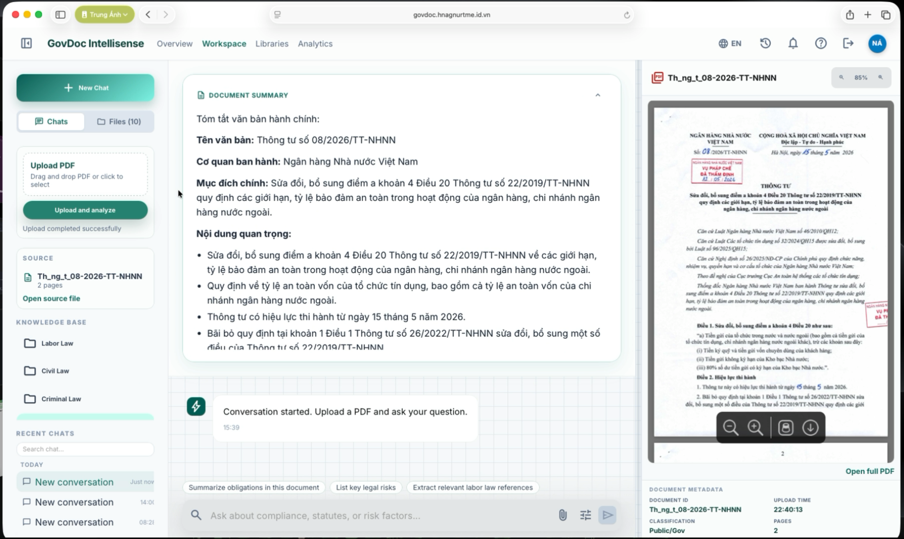
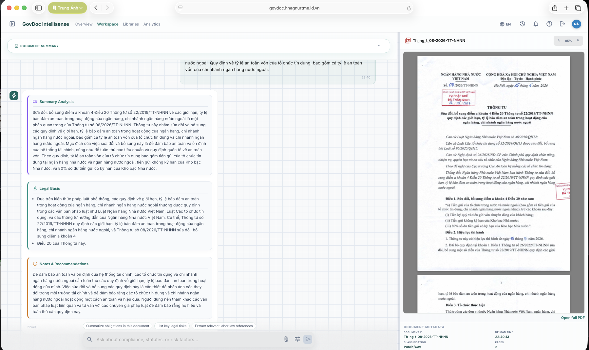

<p align="center" style="display: flex; justify-content: center; align-items: center; flex-wrap: wrap; gap: 15px;">
  
  
  
  
  
  
  
  
</p>

# GovDoc Intellisense

A **premium, high-performance Retrieval-Augmented Generation (RAG) system** for optimizing document search and legal question answering in **Vietnamese legal networks** using **LangGraph orchestration**, **Qdrant semantic vector search**, and **OpenRouter/Groq LLM streaming response model**.

---

## 🏛️ System Architecture

### High-Level System Architecture
<p align="center">
  
  <br/>
  <em>Complete system architecture topology mapping Cloudflare, Traefik, AWS environment, application containers, and databases.</em>
</p>


### Subgraph Sequence Flows

#### 1. Ingestion Pipeline (Document Import Subgraph)


#### 2. RAG Query Execution (User Query Subgraph)


---

## 🖥️ Screen Previews

### 1. Document Ingestion
<p align="center">
  
  <br/>
  <em>Sleek file uploading pipeline parsing and indexing PDFs semantically.</em>
</p>

### 2. Knowledge Base Summary
<p align="center">
  
  <br/>
  <em>Knowledge base overview and legal data insights.</em>
</p>

### 3. Conversational QA
<p align="center">
  
  <br/>
  <em>Interactive legal query answering with strict article-level citation referencing.</em>
</p>

---

## 🛠️ Technology Stack

| Component | Technical Selection | Purpose |
| :--- | :--- | :--- |
| **User Interface** | React 19 + TypeScript + Vite | Responsive dashboard, markdown styling, document manager. |
| **Gateway & CDN** | Cloudflare + Traefik | Edge routing proxy with CDN protection, directing traffic to AWS services. |
| **API Web Server** | FastAPI (Python 3.11) | Lightweight asynchronous endpoints, stream output handling. |
| **State & Workflow** | LangGraph 0.2 | Graph-based conversational agent routing. |
| **Vector DB** | Qdrant 1.17 | Scalable semantic search engine with payload filtering. |
| **Embedding Model** | BAAI/bge-m3 | Dual-encoder for multi-lingual representation. |
| **LLMs (AI Model)** | Groq (Llama-3) & OpenRouter (Grok-3) | Contextual answer synthesis and fallback resolution. |

---

## 📁 Repository Layout

```text
├── Backend/                 # FastAPI server codebase
│   ├── app/                 # FastAPI routes, schemas, DB sessions, LangGraph files
│   ├── feature_engineering/ # Offline text pipeline processing legal laws
│   └── tests/               # Python unit and integration testing suite
├── Frontend/                # React dashboard interface built using TypeScript
├── Data/                    # Compose settings running Qdrant locally
├── Devops/                  # Production multi-stage Docker deployment setup
└── docs/                    # Interface screenshots and documentation assets
```

---

## ⚡ Quick Start Guide

### 1. Clone & Set Up Directory
```bash
git clone https://github.com/hnagnurtme/GovDoc.git
cd GovDoc
```

### 2. Configure Environment variables
Create a `.env` configuration file in `Backend/.env`:
```env
# LLM APIs
OPENROUTER_API_KEY=sk-or-...
GROQ_API_KEY=gsk_...
OPENROUTER_MODEL=x-ai/grok-3
GROQ_MODEL=llama-3.1-70b-versatile

# Vector Database Settings
QDRANT_URL=http://127.0.0.1:6333
QDRANT_API_KEY=
QDRANT_COLLECTION=law_chunks

# Embedding Specifications
EMBED_MODEL=BAAI/bge-m3
EMBED_DIM=1024
LOG_LEVEL=INFO

# Relational Metadata DB
DB_URL=sqlite:///./govdoc.db
```

### 3. Run Locally with Docker Compose (Recommended)
This runs the entire gateway, frontend, API backend, and Qdrant in parallel:
```bash
cd Devops
docker compose up -d --build
```
Once healthy, navigate to:
* **Frontend UI:** `http://localhost:3000`
* **API Service:** `http://localhost:8000/api/v1/health`

